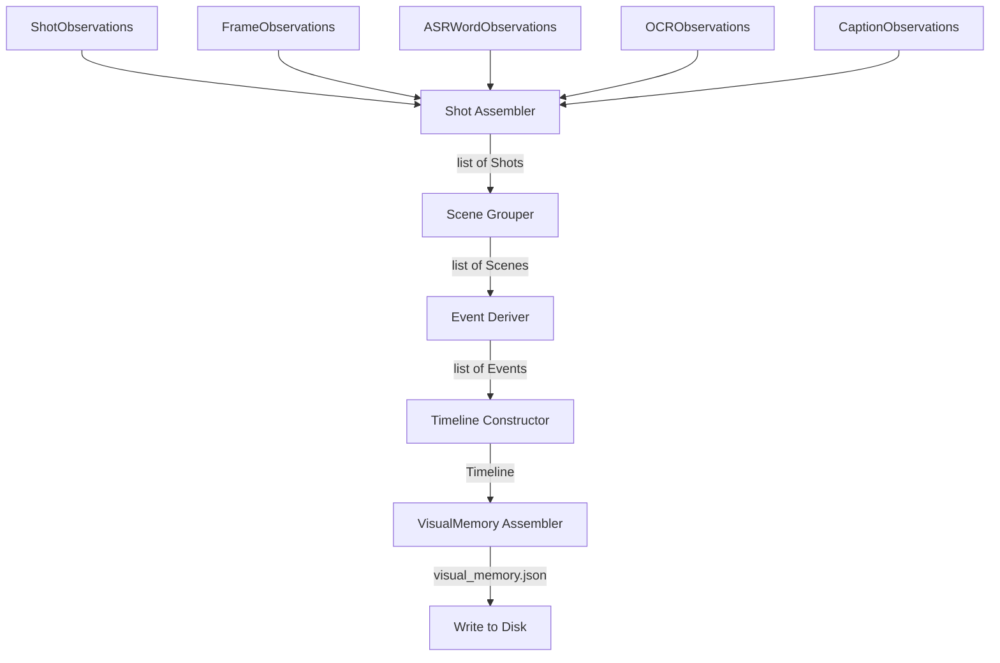

# Compiler

The deterministic compiler is responsible for merging and sequencing the independent, raw streams of `Observation` objects into a single, unified visual memory representation of the video.

## Pipeline Flow

## Compiler Modules

### 1. Shot Assembler (`assemble_shots`)
Combines multiple observations (keyframes, OCR, ASR words, VLM captions) into a structured `Shot` object based on timing and shot IDs.

### 2. Scene Grouper (`SceneGrouper`)
Groups consecutive shots into semantically coherent `Scene` objects based on:
- Caption semantic similarity (cosine similarity of text embeddings)
- Chronological time gap between shots

### 3. Event Deriver (`EventDeriver`)
Heuristically extracts derived `Event` objects of specific types:
- `SpeakerChange`: Identified when a silence gap (> 1500ms) occurs between consecutive transcribed words.
- `SlideTransition`: Identified when OCR screen texts on consecutive keyframes in the same shot differ significantly (Jaccard similarity of words < 0.5).
- `SceneBoundary`: Automatically generated at the boundaries between adjacent scenes.

### 4. Timeline Constructor (`construct_timeline`)
Sequences all scenes and events chronologically into a single master `Timeline` structure, validating that all timestamps are within the video's total duration constraints.

## Outputs

The compiler writes the following files to the output directory:

- `visual_memory.json` — The top-level compiled output index artifact.
- `timeline.json` — Chronological sequence of scenes and derived events.
- `scene_index.json` — Individual scene objects with their associated shots.
- `ocr.json` — List of all OCR screen text observations.
- `asr.json` — List of all transcribed word observations.
